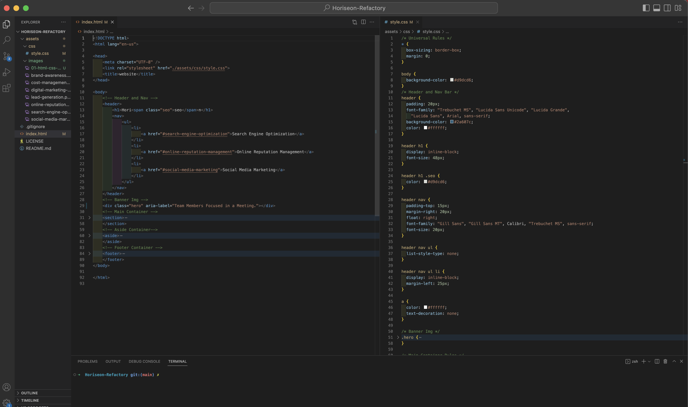
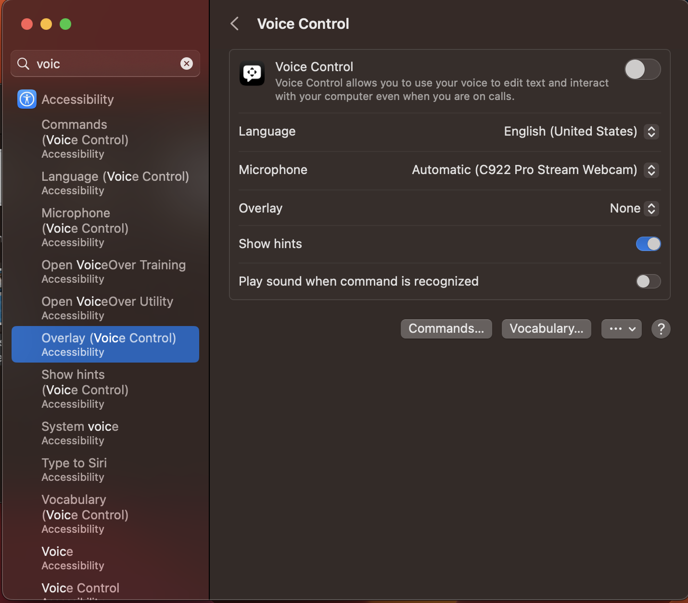

# Horiseon-Refactory (Module 1 Challenge)

## Purpose/Goal 
  To take the given code and focus on Refoctoring the HTML to include Semantic Elements and organize the CSS style sheet to be set in a logical order of what is displayed on the page itself. It also is meant to test my ability to create an optimized codebase that is in line with the Accessibility Standards set in place. This is to provide a real-world example of what might be given as a possible task when working on project with a team, as well as to test my understanding of what Semantic Elements in HTML will look like when applied. 
  
 ## User Story
  The given User Story is as follows:
    
    AS A marketing agency
    I WANT a codebase that follows accessibility standards
    SO THAT our own site is optimized for search engines
    
  ## Acceptance Criteria
    GIVEN a webpage meets accessibility standards
      * WHEN I view the source code
        THEN I find semantic HTML elements
      * WHEN I view the structure of the HTML elements
        THEN I find that the elements follow a logical 
        structure independent of styling and positioning
      * WHEN I view the image elements
        THEN I find accessible alt attributes
      * WHEN I view the heading attributes
        THEN they fall in sequential order
      * WHEN I view the title element
        THEN I find a concise, descriptive title
        
 ## Assets
 
 The Following image demonstrates the landing page's desired layout:
 

## Purpose of the Project 

The purpose behind this porject/module is to test my ability in refactory work. Giving me an oppurtunity to felx my abiltiy in adding and creating semantic HTML elements. As well as using 'alt' tags to create a website that has good SEO and follows the Accessiblity Standards for those that use screen readers. This project also gives me that chance to see what working in the industry is like as a web developer. 

## Challenges

 This project tested something new too me as a developer, Refactoring code. I found that it was harder than I thought when I first started working on this assignment. As I was use to using 'DIV' and 'Class Elements' to add styling to my webpage prior to starting this course. I felt it was a good barrier to work through as I can now see that using Semantic Elements can make ones codebase apper easier to read and write going foward. I found that the best way to refactor the codebase was to use a split pane in my VSCODE and Collapse all the sections in the HTML index and CSS stylesheet. Then only un-collapsing the section I was work on in both documents to clearly see what I was working on at any given time. 
 
The following image shows the Collapsing technique I used :

## Learning Moment

One of the Acceptance Criteria of the project was to use 'alt' tags in the HTML document in-order to create a SEO website and to adhere Accessiblity Standards. Well working on refactroring the HTML file, I noticed the 'div' with a class of 'Hero'. When I checked the CSS I saw background-img was being applied to the 'div'. Not knowing what exactly to do, I look into possible solitions to the problem and found out about the 'Aria-label' attribute to be a solution to my issue. 

Setting up the element as: 

 

Allows screen readers to treat the attribute as a stand in 'alt' attribute. 

## Testing the solution

To make sure this worked, I turned on the screen reader on macOS - Voice Over. To do this, I simply went to settings and typed in Voice Over in the search bar. 

After that, I opend the webpage and listent for my 'Aria-label' to be read allowed. 

##Take Aways 

This was a well designed project to work on sematic elements and SEO. I learend that there is a lot more to refeactor work than I had orginal thought. This Was a great learning tool for me to start seeing what the day to day work life of a web developer could look like. Getting a hands on approach to the industry is a huge step in my ability as a developer.

## Links
This links to the live page: 
